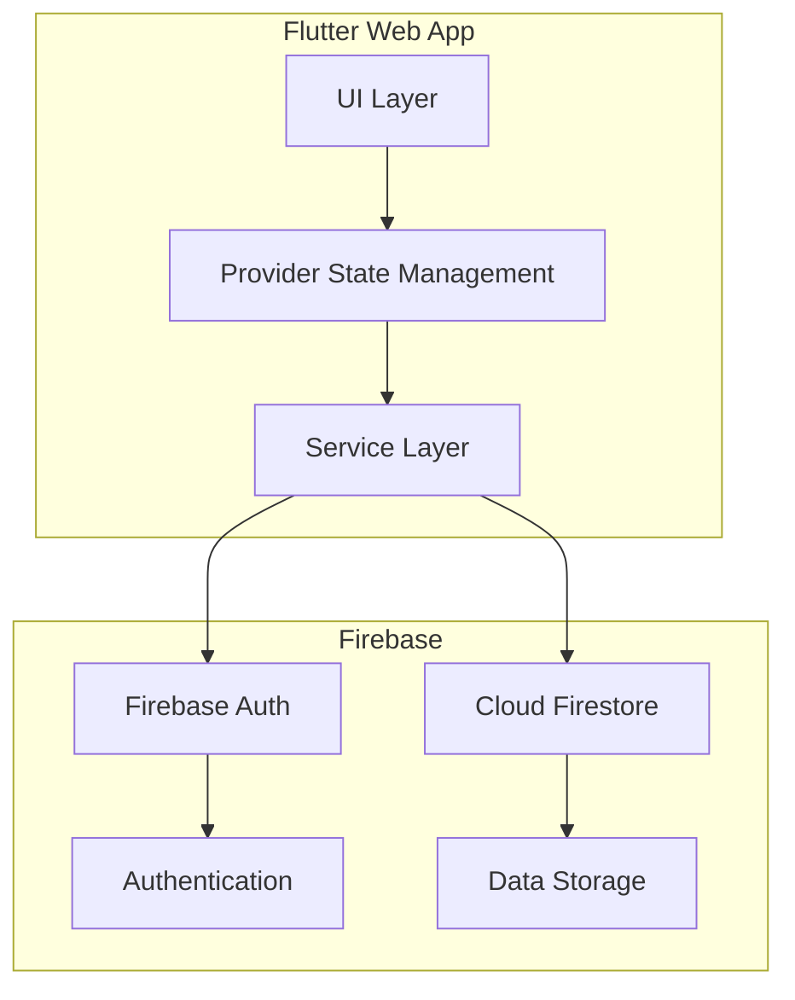

# Pix Mind Architecture

## MVVM Pattern Implementation

### Model
- UserModel
- PostModel

### View
- All UI screens (Splash, Onboarding, Login, Signup, Home, Profile, etc.)

### ViewModel (Provider)
- AuthProvider
- PostProvider
- SearchProvider

## Data Flow

1. **User Interaction**: User interacts with UI components
2. **State Management**: Providers manage application state
3. **Service Layer**: Services handle business logic and API calls
4. **Firebase**: Authentication and data storage
5. **Real-time Updates**: Firestore listeners provide real-time data updates